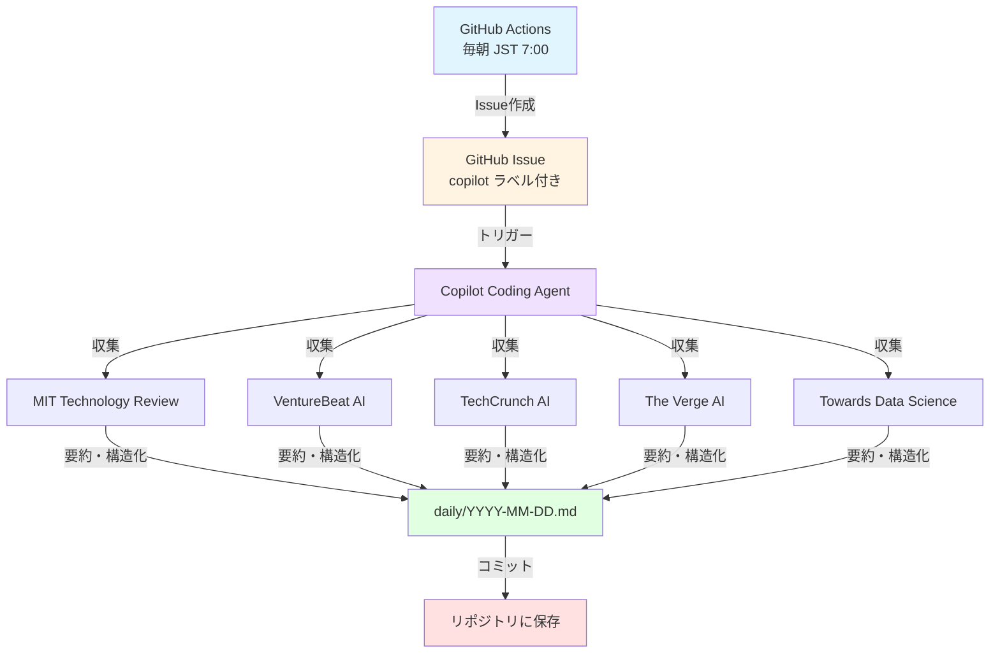

# 🤖 AI News Daily Digest

Copilot Coding Agentによる自動ニュース収集・要約システム

[](https://github.com/office8-inc/ai-news-digest/actions/workflows/daily-digest.yml)

## 📖 概要

AI関連の最新ニュースを毎日自動収集・要約し、**10分程度で読めるMarkdownファイル**を生成するシステムです。GitHub Copilot Coding Agentを活用し、厳選された5つのニュースサイトから重要な情報を日本語でまとめます。

### 🎯 目的
- AI分野の最新情報を効率的にキャッチアップ
- 技術動向、ビジネス応用、社会的影響を網羅的に把握
- 実践的なアクションアイテムの提供

## 🗂️ ディレクトリ構成

```
ai-news-digest/
├── .github/
│   ├── workflows/
│   │   └── daily-digest.yml          # GitHub Actions ワークフロー
│   ├── ISSUE_TEMPLATE/
│   │   └── daily-digest.md           # Issue テンプレート
│   └── copilot-instructions.md       # Copilot 指示書
├── daily/
│   ├── .gitkeep
│   └── YYYY-MM-DD.md                 # 日次ダイジェスト (自動生成)
├── README.md
└── .gitignore
```

## 🏗️ システム構成



## 📰 収集対象ニュースサイト（5サイト厳選）

| サイト | URL | 特徴 |
|--------|-----|------|
| **MIT Technology Review** | [Link](https://www.technologyreview.com/topic/artificial-intelligence/) | アカデミック視点、深い技術分析 |
| **VentureBeat AI** | [Link](https://venturebeat.com/category/ai/) | ビジネス応用、投資動向 |
| **TechCrunch AI** | [Link](https://techcrunch.com/tag/artificial-intelligence/) | スタートアップ、最新プロダクト |
| **The Verge AI** | [Link](https://www.theverge.com/artificial-intelligence) | 社会的影響、わかりやすい解説 |
| **Towards Data Science** | [Link](https://towardsdatascience.com/) | ハンズオン、実践的技術記事 |

## 🚀 使い方

### 自動実行（推奨）
毎朝 **JST 7:00** に自動的にIssueが作成され、Copilot Coding Agentが起動します。特に設定は不要です。

### 手動実行
1. [Actions](../../actions/workflows/daily-digest.yml) タブを開く
2. 「Run workflow」をクリック
3. ブランチを選択して実行

または、手動でIssueを作成：
1. [New Issue](../../issues/new/choose) から「📰 Daily Digest Request」を選択
2. 日付を入力して作成
3. `copilot` ラベルが自動付与されます

## 📝 出力フォーマット

生成されるダイジェストファイル（`daily/YYYY-MM-DD.md`）には以下が含まれます：

- **📋 本日のハイライト**: 重要ポイント3つ
- **📰 ニュース詳細**: 各記事の要約（200-300文字）
- **💡 実践ポイント**: 各ニュースから得られる学びやアクション
- **🎯 今日のアクションアイテム**: 具体的な行動指針
- **📚 参考リンク**: 元記事へのリンク

## 🔧 カスタマイズ

### 収集サイトの変更
`.github/copilot-instructions.md` を編集して、収集対象サイトをカスタマイズできます。

### 実行時刻の変更
`.github/workflows/daily-digest.yml` の `cron` 設定を変更：
```yaml
schedule:
  - cron: '0 22 * * *'  # UTC 22:00 = JST 7:00
```

### 出力形式の変更
`.github/copilot-instructions.md` の「構造化」セクションを編集してください。

## 📊 過去のダイジェスト

[daily/](./daily/) ディレクトリに日付別のダイジェストが保存されています。

## 🤝 貢献

Issue や Pull Request を歓迎します！

## 📄 ライセンス

このプロジェクトは MIT ライセンスの下で公開されています。

---

*Generated by GitHub Copilot Coding Agent | office8-inc/ai-news-digest*
