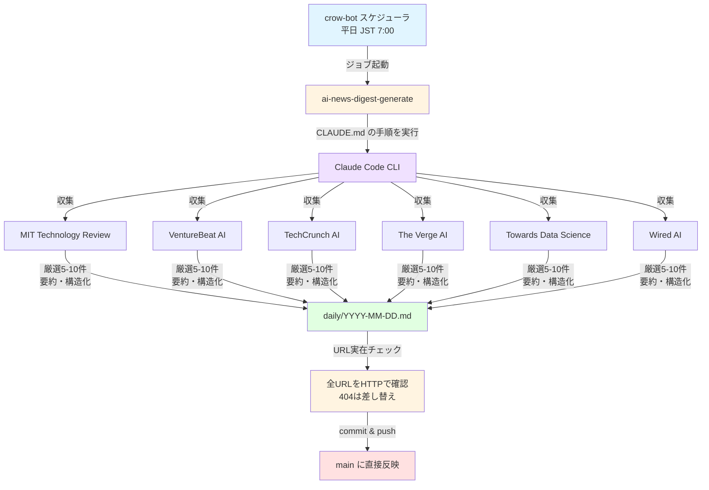

# 🤖 AI News Daily Digest

Claude による自動ニュース収集・要約システム

## 📖 概要

AI関連の最新ニュースを毎日自動収集・要約し、**10分程度で読めるMarkdownファイル**を生成するシステムです。Claude Code を活用し、厳選された6つのニュースサイトから重要な情報を日本語でまとめます。

### 🎯 目的
- AI分野の最新情報を効率的にキャッチアップ
- 技術動向、ビジネス応用、社会的影響を網羅的に把握
- 実践的なアクションアイテムの提供

## 🗂️ ディレクトリ構成

```
ai-news-digest/
├── CLAUDE.md                         # 生成エージェント向け指示書
├── .article-history/
│   ├── articles-history.json         # 過去記事履歴（重複防止用）
│   └── README.md                     # 履歴管理の説明
├── daily/
│   ├── .gitkeep
│   └── YYYY-MM-DD.md                 # 日次ダイジェスト (自動生成)
├── docs/
│   └── duplicate-article-risk-analysis.md  # 重複リスク分析レポート
├── README.md
└── .gitignore
```

## 🏗️ システム構成


```mermaid
graph TD
    A[crow-bot スケジューラ<br/>平日 JST 7:00] -->|ジョブ起動| B[ai-news-digest-generate]
    B -->|CLAUDE.md の手順を実行| C[Claude Code CLI]
    C -->|収集| D1[MIT Technology Review]
    C -->|収集| D2[VentureBeat AI]
    C -->|収集| D3[TechCrunch AI]
    C -->|収集| D4[The Verge AI]
    C -->|収集| D5[Towards Data Science]
    C -->|収集| D6[Wired AI]
    D1 & D2 & D3 & D4 & D5 & D6 -->|厳選5-10件<br/>要約・構造化| E[daily/YYYY-MM-DD.md]
    E -->|URL実在チェック| G[全URLをHTTPで確認<br/>404は差し替え]
    G -->|commit & push| F[main に直接反映]
    
    style A fill:#e1f5ff
    style B fill:#fff4e1
    style C fill:#f0e1ff
    style E fill:#e1ffe1
    style G fill:#fff4e1
    style F fill:#ffe1e1
```

## 📰 収集対象ニュースサイト（6サイト）

| サイト | URL | 特徴 |
|--------|-----|------|
| **MIT Technology Review** | [Link](https://www.technologyreview.com/topic/artificial-intelligence/) | アカデミック視点、深い技術分析 |
| **VentureBeat AI** | [Link](https://venturebeat.com/category/ai/) | ビジネス応用、投資動向 |
| **TechCrunch AI** | [Link](https://techcrunch.com/tag/artificial-intelligence/) | スタートアップ、最新プロダクト |
| **The Verge AI** | [Link](https://www.theverge.com/ai-artificial-intelligence) | 社会的影響、わかりやすい解説 |
| **Towards Data Science** | [Link](https://towardsdatascience.com/) | ハンズオン、実践的技術記事 |
| **Wired (AI)** | [Link](https://www.wired.com/tag/artificial-intelligence/) | 深い調査報道、社会的影響、政策分析 |

**収集方針**: 6サイトから合計5-10件の重要記事を厳選（記事数は従来通り）

## 🚀 使い方

### 自動実行（推奨）
**平日 JST 7:00** に常駐ボット（crow-bot）のスケジューラジョブ `ai-news-digest-generate` が
Claude Code を起動し、生成から main への push まで行います。特に設定は不要です。

GitHub Actions では生成しません（Claude をサブスクリプション枠で動かすため、
API キーを Secrets に置かない設計です）。

### 手動実行
リポジトリを clone し、Claude Code に [CLAUDE.md](./CLAUDE.md) の手順を実行させます：

```bash
git clone https://github.com/office8-inc/ai-news-digest.git
cd ai-news-digest
claude -p "CLAUDE.md の手順で本日分のダイジェストを生成して"
```

## 📝 出力フォーマット

生成されるダイジェストファイル（`daily/YYYY-MM-DD.md`）には以下が含まれます：

- **📋 本日のハイライト**: 重要ポイント3つ
- **📰 ニュース詳細**: 各記事の要約（200-300文字）
- **💡 実践ポイント**: 各ニュースから得られる学びやアクション
- **🎯 今日のアクションアイテム**: 具体的な行動指針
- **📚 参考リンク**: 元記事へのリンク

## 🔒 重複記事の防止

このシステムは、**重複記事の自動検出・防止機能**を実装しています：

### 仕組み
1. **履歴管理**: 過去7日分の収集記事を `.article-history/articles-history.json` に記録
2. **重複チェック**: 新規収集時に以下をチェック：
   - 記事URLの重複
   - 記事タイトルの類似性
   - 公開日時の確認（真に24時間以内の記事か）
3. **自動スキップ**: 重複記事は自動的に除外され、次の候補記事を選定
4. **履歴更新**: 収集後、**Claude** が新規記事情報を自動追記・古い履歴を自動削除

### メンテナンス
- **メンテナンス担当**: Claude（crow-bot のスケジューラジョブ）
- **更新タイミング**: 毎日のニュース収集タスク完了時
- **手動操作**: 基本的に不要（自動的に管理）

### メリット
- ✅ **常に新鮮な情報**: 同じ記事が連日収集されることを防ぐ
- ✅ **読者満足度向上**: 重複コンテンツによる読者の時間浪費を防止
- ✅ **システム信頼性**: 予測可能で一貫性のある記事収集

### 詳細
重複リスクの分析と対策の詳細は [重複リスク分析レポート](./docs/duplicate-article-risk-analysis.md) を参照してください。

## 🔧 カスタマイズ

### 収集サイトの変更
[CLAUDE.md](./CLAUDE.md) を編集して、収集対象サイトをカスタマイズできます。

### 実行時刻の変更
crow-bot 側のスケジューラ定義（`ai-news-digest-generate` ジョブ）を変更します。

### 出力形式の変更
[CLAUDE.md](./CLAUDE.md) の「構造化」セクションを編集してください。

## 📊 過去のダイジェスト

[daily/](./daily/) ディレクトリに日付別のダイジェストが保存されています。

## 🤝 貢献

Issue や Pull Request を歓迎します！

## 📄 ライセンス

このプロジェクトは MIT ライセンスの下で公開されています。

---

*Generated by Claude (crow-bot) | office8-inc/ai-news-digest*
